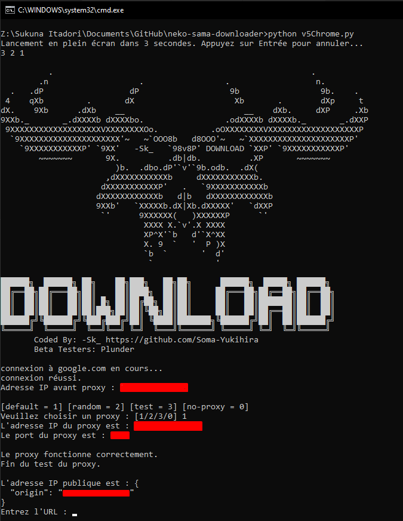

<h1 align="center">Welcome to neko-sama-downloader 👋</h1>
<p>
  
  <a href="https://github.com/Soma-Yukihira/neko-sama-downloader/blob/main/LICENSE" target="_blank">
    
  </a>
</p>

> Un script python qui permet de récupérer les liens de streaming du site : neko-sama.fr Les liens sont enregistrés dans un fichier.txt avec le nom de l'anime. Le synopsis est écrit au début du fichier.



### ✨ [Demo](https://github.com/Soma-Yukihira/neko-sama-downloader/blob/main/download.png)

## ⚡Install

```sh
pip install -r requirements.txt
```

## 🚀Usage

```sh
python v5Chrome.py
```

## 🚀Author

👤 **-Sk_**

* Website: https://github.com/Soma-Yukihira
* Github: [@Soma-Yukihira](https://github.com/Soma-Yukihira)

## 🤝 Contributing

Contributions, issues and feature requests are welcome!<br />Feel free to check [issues page](https://github.com/Soma-Yukihira/neko-sama-downloader/issues). 

## Show your support

Give a ⭐️ if this project helped you!

## 📝 License

Copyright © 2023 [-Sk_](https://github.com/Soma-Yukihira).<br />
This project is [MIT](https://github.com/Soma-Yukihira/neko-sama-downloader/blob/main/LICENSE) licensed.

